# FIREWALL RULES
## 📌 Objective  
Learn how to configure and test basic firewall rules on **Windows** and **Linux** to allow or block specific traffic.

## 🛡️ What is a Firewall?

A **firewall** is a security system that monitors and controls incoming and outgoing network traffic based on predefined rules.  
It is used to **protect systems from unauthorized access, block malicious traffic, and allow only trusted communication**.

## 🛠 Tools Used
- **Windows Firewall**  on Windows  
- **UFW (Uncomplicated Firewall)** on Linux  

## 🚀 Steps Performed
1. Setting up Firewall rules in Windows
2. Setting up the Firewall rules in Linux
3. Trying to take access to Windows over the SSH from Linux when SSH is open and close

## 📌 1. Setting up Firewall Rules in Windows

Windows uses **Windows Defender Firewall** to control inbound/outbound traffic.

### ✅ Steps via GUI:
1. Open **Windows Security** → Click on **Firewall & Network Protection**.
2. Select **Advanced Settings** → This opens **Windows Defender Firewall with Advanced Security**.
3. To create a new rule:
   - Click **Inbound Rules** → **New Rule**.
   - Choose **Port** → Select **TCP**.
   - Enter port number (e.g., `22` for SSH).
   - Select **Allow the connection** (to allow) or **Block the connection** (to block).
   - Name the rule (e.g., `Allow SSH`).
4. Repeat the same for **Outbound Rules** if required.

### NOTE:
- **Allow SSH** on port `22` → Remote systems can connect.  
- **Block SSH** on port `22` → Remote systems cannot connect.

# 

### ✅ Steps via Powershell:

- Open PowerShell (as Administrator) and run:

##### 🔍 Check for ports that are currently in a listening state
```Powershell
netstat -ano | findstr Listening
```
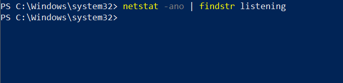

##### 🚫 Block Telnet (Port 23)

Run the following command in PowerShell to block inbound Telnet traffic:

```Powershell
New-NetFirewallRule -DisplayName "Block Telnet" -Direction Inbound -Protocol TCP -LocalPort 23 -Action Block
```
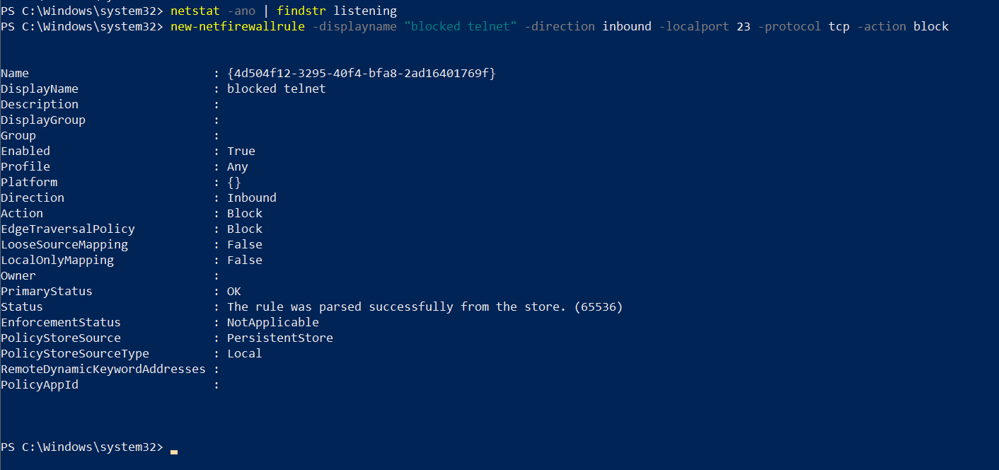

##### ✅ Allow SSH (Port 22)

Run the following command in PowerShell to **allow inbound SSH traffic**:

```powershell
New-NetFirewallRule -DisplayName "Allow SSH" -Direction Inbound -Protocol TCP -LocalPort 22 -Action Allow
```
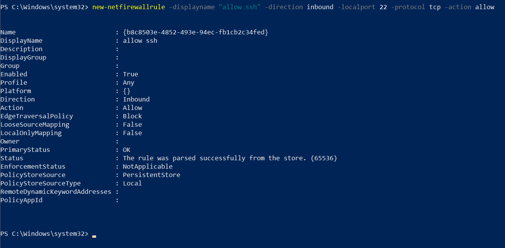

##### ✅ Verify the rules:

```Powershell
Get-NetFirewallRule | Findstr Telnet
```
```Powershell
Get-NetFirewallRule | Findstr SSH
```
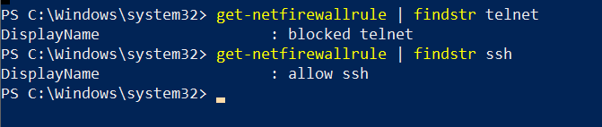

---

## 📌 2. Setting up Firewall Rules in Linux

Linux commonly uses **ufw** (Uncomplicated Firewall) or **firewalld**. Below is with `ufw`.

### ✅ Steps (using ufw):
####  Check firewall status:**
   ```bash
 sudo ufw status
   ```
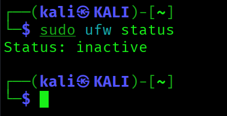
####  Enable UFW (if disabled)
```bash
sudo ufw enable
```
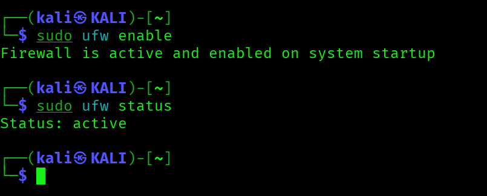

####  Blocked Inbound Traffic on Port 23 (Telnet)
   ``` bash
   sudo ufw deny 23
   ```
Running sudo ufw deny 23/tcp → Linux will block Telnet connections.

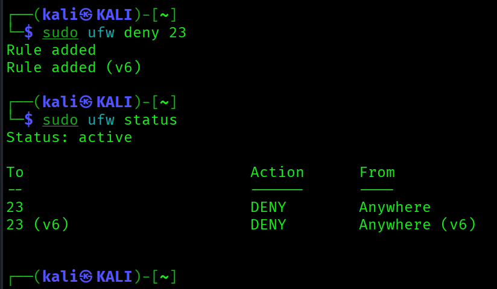

####   Allowed Inbound Traffic on Port 22 (SSH)
``` bash
sudo ufw allow 22
```
Running sudo ufw allow 22/tcp → Linux will allow SSH connections.``

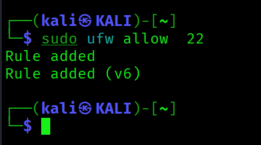

#### Listed Current Firewall Rules
   ```  bash
   sudo ufw status
   ```
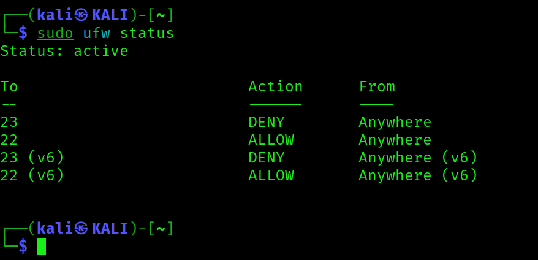

#### Removed Test Rule to Restore Original State
``` bash
sudo ufw delete deny 22
```

## 📌 3. Accessing Windows from Linux using SSH
### ✅ Pre-requisites:

- Windows must have OpenSSH Server installed and running.

- Firewall must allow inbound SSH (22/tcp).

### Steps:
### From Windows, run:
- Open PowerShell (as Administrator) and run:
#### Run sshd (SSH Server)
```Powershell
Start-Service sshd
```

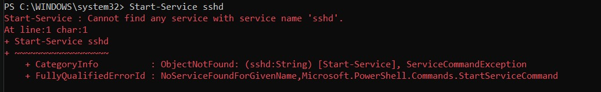
- If Windows is saying **sshdnot recognized.**

- That happens if the OpenSSH server isn’t installed or enabled on your system.

- Here’s how to fix it step by step:

##### 1. Check if OpenSSH is installed
```Powershell
Get-WindowsCapability -Online | Where-Object Name -like 'OpenSSH*'
```
**Expected Oouput:**
You’ll see two items:

```
OpenSSH.Client~~~~0.0.1.0

OpenSSH.Server~~~~0.0.1.0
```

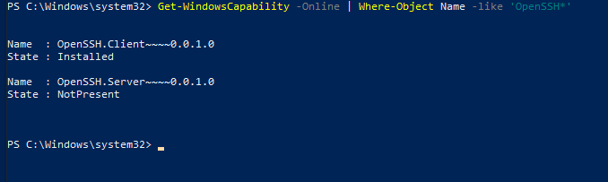


**Check if Server is marked as Installed**

#### 2. Install OpenSSH Server (if not installed)

If OpenSSH.Server shows NotPresent, install it with:
```Powershell
Add-WindowsCapability -Online -Name OpenSSH.Server~~~~0.0.1.0
```

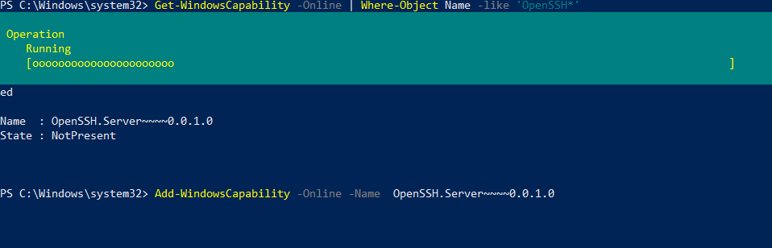


##### 3. Check and start the service

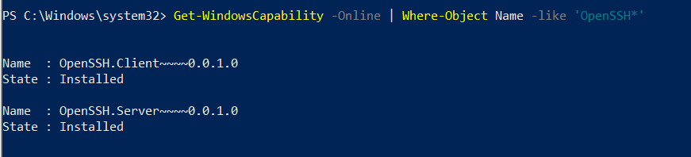

Once installed, restart the system and run:

```Powershell
Start-Service sshd
```

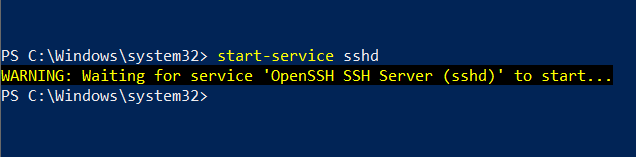


##### 4. Verify the service

Check the status:

```Powershell
Get-Service sshd
```
It should show Running.

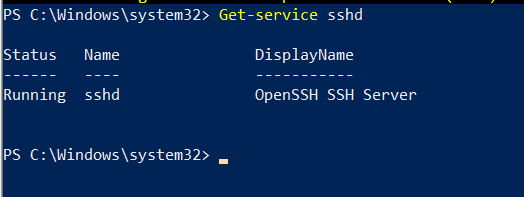

### From Linux, run:
- Open Terminal 
```bash
ssh <username>@<windows-ip>
```
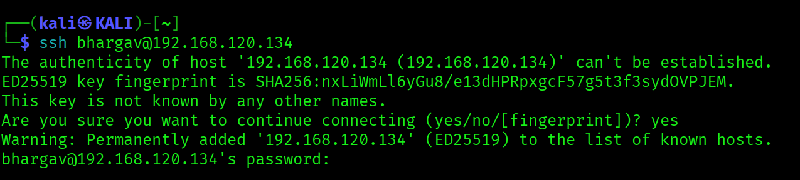

#### NOTE:
SSH access requires the user password;

#### Access Gained via SSH:
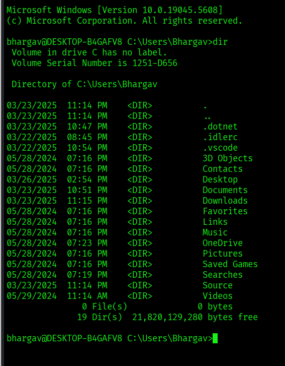


### NOTE:
- If SSH is open & allowed in firewall → You will connect successfully.

- If SSH is blocked in firewall → You will get:
```bash
ssh: connect to host 192.168.120.134 port 22: Connection refused
```
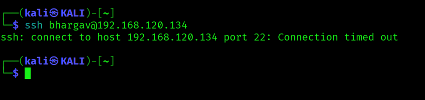

---


#### Summarized Findings

- Firewall rules filter inbound and outbound traffic.

- Blocking insecure services to improves system security.

